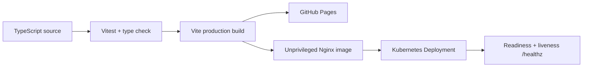

# Trending Pages

> **Three interface studies, rebuilt as one engineering system.**

`Trending Pages`는 서로 다른 목적으로 만들었던 3개의 Vanilla HTML/CSS/JavaScript 클론 프로젝트를 하나의 TypeScript 기반 포트폴리오로 통합한 프로젝트입니다. 복제 정확도보다 **상태 설계, 재사용 가능성, 접근성, 테스트, 배포 운영성**을 함께 보여주는 데 초점을 두었습니다.

## Portfolio narrative

이 저장소는 “Java Backend에서 Cloud·AI·Data로 확장하는 Software Engineer”라는 커리어 방향을 다음 세 가지 증거로 받쳐줍니다.

1. **Build** — 데이터 기반 UI와 상태 변화를 React + TypeScript로 구현
2. **Verify** — 사용자가 접하는 핵심 흐름을 Vitest + Testing Library로 검증
3. **Ship** — CI gate, 멀티 스테이지 Docker 이미지, Nginx health check, Kubernetes 배포 정의로 운영 경계까지 설계

## Three experiences

| Experience | Origin | Re-engineered capability |
| --- | --- | --- |
| **Signal Bank** | [kakao-page](https://github.com/taeyoungk-dev/kakao-page) | 스크롤 내러티브를 즉시 반응형 자산 시뮬레이터로 확장 |
| **Stay Atlas** | [airbnb-clone-page](https://github.com/taeyoungk-dev/airbnb-clone-page) | 반복 마크업을 typed data, 필터, 즐겨찾기 상태 기반 컴포넌트로 전환 |
| **Wildline** | [Firewatch-clone-page](https://github.com/taeyoungk-dev/Firewatch-clone-page) | 명령형 스크롤 transform을 제한된 포인터 패럴랙스와 motion-safe CSS로 재설계 |

각 케이스 스터디의 **Live Interaction**에서 범위 입력, 필터/즐겨찾기, 포인터 패럴랙스를 직접 실행할 수 있습니다. `Escape`로 모달을 닫을 수 있고 `prefers-reduced-motion`을 준수합니다.

## Technology stack

- **Interface:** React 19, TypeScript 7, Vite 8, semantic HTML, responsive CSS
- **Quality:** Vitest 5, Testing Library, strict TypeScript, keyboard interaction, reduced-motion fallback
- **Delivery:** GitHub Actions, GitHub Pages, multi-stage Docker, unprivileged Nginx
- **Platform:** Kubernetes Deployment/Service, readiness/liveness probes, resource limits, non-root security context

## Architecture



이 버전은 포트폴리오를 바로 확인할 수 있도록 정적 배포를 우선합니다. Java/Spring Boot, PostgreSQL, Redis, Kafka는 후속 데이터 플랫폼에서 실제 사용 케이스가 추가될 때 도입하며, 현재 저장소는 구현하지 않은 기술을 사용했다고 표기하지 않습니다.

## Local development

```bash
npm install
npm run dev
```

Quality gate:

```bash
npm run check
```

Production container:

```bash
docker build -t trending-pages .
docker run --rm -p 8080:8080 trending-pages
curl http://localhost:8080/healthz
```

Kubernetes manifests are in [`infra/k8s/deployment.yaml`](infra/k8s/deployment.yaml). Replace the example image tag with an immutable digest for production.

## Repository map

```text
.
├── .github/workflows/ci.yml   # test, build, GitHub Pages delivery
├── infra/
│   ├── k8s/deployment.yaml     # workload, probes, limits, service
│   └── nginx.conf              # SPA routing, cache, security headers
├── src/
│   ├── App.tsx                 # portfolio and three interactions
│   ├── data.ts                 # typed project content
│   ├── styles.css              # responsive visual system
│   └── App.test.tsx            # critical user-flow tests
├── Dockerfile
└── vite.config.ts
```

## Author

**김태영 / Taeyoung Kim** — Software Engineer, Cloud & Infrastructure

- [GitHub](https://github.com/taeyoungk-dev)
- [LinkedIn](https://www.linkedin.com/in/katiekim412)
- [Email](mailto:katiekim412@gmail.com)

---

This is an independent educational portfolio. Brand-inspired origins are credited above; the unified visual system and interactions are original work for this repository.
