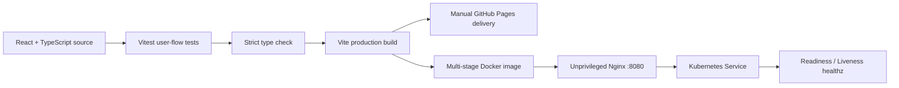

# Trending Pages

> **Three interface studies, rebuilt as one engineering system.**
>
> 세 개의 클론 프로젝트를 하나의 설계 언어와 배포 파이프라인으로 통합한 Software Engineering Portfolio

## Table of contents

- [Project overview](#project-overview)
- [Why this project](#why-this-project)
- [Core experiences](#core-experiences)
- [Engineering decisions](#engineering-decisions)
- [Technology stack](#technology-stack)
- [Architecture and delivery](#architecture-and-delivery)
- [Quality and accessibility](#quality-and-accessibility)
- [Run locally](#run-locally)
- [Repository structure](#repository-structure)
- [Career alignment](#career-alignment)
- [Portfolio copy](#portfolio-copy)
- [Roadmap](#roadmap)

## Project overview

`Trending Pages`는 서로 다른 시점에 만든 3개의 Vanilla HTML/CSS/JavaScript 프로젝트를 React + TypeScript 기반의 하나의 포트폴리오로 재설계한 프로젝트입니다.

단순히 세 페이지를 한 저장소에 모은 것이 아닙니다. 기존 프로젝트의 핵심 인터랙션을 분석하고, 데이터·상태·타입·접근성·테스트·배포라는 공통 엔지니어링 기준으로 다시 구성했습니다.

### Key outcomes

- 3개의 독립 클론 코딩을 1개의 일관된 제품 경험으로 통합
- 반복 마크업을 typed data와 재사용 가능한 React 컴포넌트로 전환
- 금융 계산, 탐색 필터, 즐겨찾기, 포인터 패럴랙스를 실제 상태 기반 인터랙션으로 구현
- 모달의 `Escape` 종료, 시맨틱 마크업, `prefers-reduced-motion` 대응
- 테스트 → 타입 검사 → 프로덕션 빌드로 이어지는 자동 CI gate 구성
- 멀티 스테이지 Docker, non-root Nginx, Kubernetes probe·resource·security context 정의

## Why this project

초기 프로젝트들은 각각 특정 CSS/JavaScript 기법을 학습하는 데 효과적이었지만, 채용 포트폴리오로서는 다음 한계가 있었습니다.

- 프로젝트 간 시각 언어와 코드 구조가 연결되지 않음
- 데이터와 UI가 마크업에 반복되어 변경 비용이 큼
- 상태와 인터랙션이 DOM 조작에 강하게 결합됨
- 테스트와 배포 자동화가 없어 완성도를 재현하기 어려움

이 프로젝트는 이를 **Build → Verify → Ship**이라는 하나의 이야기로 해결합니다.

1. **Build** — 상태 변화와 사용자 피드백을 React + TypeScript로 모델링
2. **Verify** — 사용자가 실제로 수행하는 핵심 흐름을 자동 테스트로 보호
3. **Ship** — 정적 호스팅과 컨테이너/클러스터 배포 경로를 명확히 분리

## Core experiences

### 01. Signal Bank — reactive fintech narrative

**Origin:** [kakao-page](https://github.com/taeyoungk-dev/kakao-page)

스크롤 위치에 따라 텍스트와 이미지를 변화시키던 기존 인터랙션을 금융 데이터 스토리텔링으로 확장했습니다.

- 월 저축액 range input에 따른 12개월 예상 자산 즉시 계산
- 입력 상태와 표시 상태를 하나의 데이터 흐름으로 관리
- 차트, 성과 지표, 계산기를 독립적으로 읽히는 정보 계층으로 구성
- range input을 label과 연결해 키보드와 보조기기 접근성 확보

**Evolution:** imperative scroll events → declarative React state

### 02. Stay Atlas — data-driven discovery grid

**Origin:** [airbnb-clone-page](https://github.com/taeyoungk-dev/airbnb-clone-page)

반복되는 숙소 마크업과 정적 카테고리 패턴을 typed data 기반 탐색 UI로 재구성했습니다.

- `ALL`, `COAST`, `FOREST` 카테고리에 따른 결과 필터링
- 숙소별 즐겨찾기 추가/해제와 즉시 시각 피드백
- 원본 데이터와 표시 컴포넌트를 분리해 항목 추가 비용 최소화
- desktop 3-column에서 mobile 1-column으로 전환되는 반응형 정보 구조

**Evolution:** repeated static cards → typed, data-driven components

### 03. Wildline — bounded parallax system

**Origin:** [Firewatch-clone-page](https://github.com/taeyoungk-dev/Firewatch-clone-page)

스크롤마다 DOM style을 직접 변경하던 레이어 패럴랙스를 포인터 기반의 제한된 모션 시스템으로 재해석했습니다.

- 포인터의 중심 대비 거리를 레이어별 제한된 비율로 변환
- CSS `clip-path`와 색상 면을 조합해 외부 이미지 없이 풍경 구성
- pointer leave 시 중립 상태로 복귀하는 안정적인 인터랙션
- `prefers-reduced-motion` 사용자에게 애니메이션을 강요하지 않음

**Evolution:** unbounded imperative transforms → motion-safe layer system

## Engineering decisions

| Decision | Why | Trade-off |
| --- | --- | --- |
| React local state | 서버 없이도 핵심 인터랙션을 즉시 실행 가능 | 새로고침 후 사용자 상태는 보존되지 않음 |
| Typed project data | 세 케이스 스터디의 구조를 일관되게 유지 | CMS나 API와는 아직 연동하지 않음 |
| CSS-generated visuals | 외부 이미지 장애와 라이선스 의존성 최소화 | 실사 이미지보다 추상적인 표현 |
| Static-first delivery | 링크 하나로 포트폴리오를 제공하고 운영 비용을 최소화 | 인증·영속 데이터·서버 분석은 후속 범위 |
| Manual production deploy | 자동 CI와 외부 공개 행위를 분리 | 최초 배포 또는 변경 반영 시 수동 실행 필요 |

## Technology stack

### Implemented now

- **Interface:** React 19, TypeScript 7, Vite 8
- **Styling:** responsive CSS, Grid, Flexbox, custom properties, `clip-path`, reduced-motion media query
- **Quality:** Vitest 5, Testing Library, strict TypeScript, production build gate
- **Delivery:** GitHub Actions, GitHub Pages-ready workflow, multi-stage Docker
- **Runtime:** unprivileged Nginx, SPA fallback, immutable asset caching, security headers, `/healthz`
- **Platform definition:** Kubernetes Deployment/Service, readiness/liveness probes, resource requests/limits, non-root security context

### Intentionally planned, not claimed as implemented

Java/Spring Boot, PostgreSQL, Redis, Kafka, observability, cloud-managed Kubernetes는 목표 기술 스택이지만 현재 버전에 구현되어 있지 않습니다. 실제 사용 케이스가 추가될 때 순차적으로 도입합니다.

## Architecture and delivery



### Continuous integration

`.github/workflows/ci.yml`은 `main` push와 pull request에서 다음 quality gate를 자동 실행합니다.

```text
npm ci → Vitest → TypeScript build → Vite production bundle
```

### Deployment paths

1. **Static portfolio:** `.github/workflows/deploy-pages.yml`을 수동 실행해 GitHub Pages로 배포
2. **Container:** Node build stage에서 bundle을 생성한 후 unprivileged Nginx 이미지로 복사
3. **Kubernetes:** 2개 replica, probe, resource boundary, capability drop을 적용한 workload 정의

운영 환경에서는 `latest` 태그 대신 검증된 이미지 digest를 사용해야 합니다.

## Quality and accessibility

### Automated tests

`src/App.test.tsx`에서 다음 사용자 흐름을 검증합니다.

- 세 케이스 스터디가 한 페이지에 모두 노출되는지
- Signal Bank 인터랙션이 열리고 `Escape`로 닫히는지
- Stay Atlas의 카테고리 필터가 결과에 반영되는지

### Accessibility choices

- 본문으로 이동하는 skip link
- button/link의 목적을 설명하는 accessible name
- `role="dialog"`, `aria-modal`, 제목 연결을 적용한 인터랙션 모달
- 모달 오픈 시 닫기 버튼으로 포커스 이동
- `Escape` 키 종료와 모달 오픈 중 body scroll 잠금
- `prefers-reduced-motion` 환경에서 전환·애니메이션 최소화

## Run locally

### Requirements

- Node.js `22.12+`
- npm `10+`
- Git

### 1. Clone and install

```bash
git clone https://github.com/taeyoungk-dev/trending_pages.git
cd trending_pages
npm ci
```

`package-lock.json`이 있으므로 저장소를 처음 받았을 때는 `npm install`보다 `npm ci`를 권장합니다.

### 2. Start the development server

```bash
npm run dev
```

터미널에 표시된 주소, 기본값 [`http://localhost:5173`](http://localhost:5173)을 브라우저에서 엽니다.

다른 포트를 사용하려면:

```bash
npm run dev -- --port 4173
```

### 3. Run the full quality gate

```bash
npm run check
```

이 명령은 테스트와 TypeScript/Vite 프로덕션 빌드를 모두 실행합니다.

### 4. Preview the production bundle

```bash
npm run build
npm run preview
```

기본 미리보기 주소는 [`http://localhost:4173`](http://localhost:4173)입니다.

### Optional: run with Docker

Docker Desktop 또는 Docker Engine을 먼저 실행한 후:

```bash
docker build -t trending-pages .
docker run --rm -p 8080:8080 trending-pages
curl http://localhost:8080/healthz
```

브라우저에서 [`http://localhost:8080`](http://localhost:8080)을 열면 됩니다. `/healthz`에서 `ok`가 반환되면 Nginx runtime이 준비된 상태입니다.

### Troubleshooting

- `EADDRINUSE`: 다른 포트를 지정합니다. `npm run dev -- --port 4173`
- 스타일이 기본 글꼴로 보임: Google Fonts 연결을 확인합니다. 오프라인에서는 system font fallback으로 정상 동작합니다.
- Docker daemon 연결 오류: Docker Desktop/Engine이 실행 중인지 확인합니다.
- 예상치 못한 dependency 오류: `node_modules`를 수정하지 말고 Node 버전을 확인한 후 `npm ci`를 다시 실행합니다.

## Repository structure

```text
.
├── .github/workflows/
│   ├── ci.yml                 # push/PR automatic quality gate
│   └── deploy-pages.yml       # manual public deployment
├── infra/
│   ├── k8s/deployment.yaml    # workload, probes, limits, service
│   └── nginx.conf             # SPA routing, cache, security headers
├── src/
│   ├── App.tsx                # portfolio sections and interactions
│   ├── App.test.tsx           # critical user-flow tests
│   ├── data.ts                # typed case-study content
│   ├── main.tsx               # application entry point
│   ├── styles.css             # visual system and responsive rules
│   └── test/setup.ts          # test environment setup
├── Dockerfile                     # build and unprivileged runtime
├── CONTRIBUTING.md                # contribution and commit rules
├── package.json
└── vite.config.ts
```

## Career alignment

이 프로젝트는 **Java Backend → Cloud/AI/Data → Cybersecurity**로 확장하는 장기 목표 중 다음 역량을 직접 증명합니다.

- 상태와 데이터 흐름을 구조화하는 소프트웨어 설계 능력
- 정적 결과물을 테스트·컨테이너·클러스터 경계까지 연결하는 시스템 사고
- 접근성, 안전한 런타임, health check, resource limit를 포함한 운영 관점
- 한국어와 영어를 함께 사용한 글로벌 포트폴리오 커뮤니케이션
- 구현한 기술과 예정 기술을 명확히 분리하는 엔지니어링 신뢰성

### Interview talking points

1. 세 개의 이질적인 프로젝트에서 어떤 공통 컴포넌트와 상태 모델을 추출했는가?
2. 패럴랙스 효과에서 시각적 깊이와 motion accessibility를 어떻게 절충했는가?
3. 정적 사이트에도 Docker, health check, Kubernetes 정의를 추가한 이유는 무엇인가?
4. 현재 정적 아키텍처에 Java API와 영속 데이터를 추가한다면 경계를 어떻게 나눌 것인가?

## Portfolio copy

### Korean summary

> 서로 다른 3개의 Vanilla JavaScript 클론 프로젝트를 React·TypeScript 기반의 하나의 포트폴리오로 재설계했습니다. 금융 계산, 숙소 탐색, 패럴랙스 인터랙션을 데이터 기반 컴포넌트로 구현하고, Vitest 자동 검증부터 Docker·Nginx·Kubernetes 배포 경계까지 연결했습니다.

### English summary

> Re-engineered three standalone Vanilla JavaScript interface studies into one React and TypeScript portfolio. Built interactive fintech, travel discovery, and parallax experiences, protected critical flows with automated tests, and defined production delivery through GitHub Actions, an unprivileged Nginx container, and Kubernetes health and resource boundaries.

### Resume bullets

- Re-engineered three independent HTML/CSS/JavaScript studies into a unified React 19 and TypeScript 7 application with reusable, typed project data.
- Implemented state-driven financial projection, category filtering, favorites, and bounded pointer-parallax interactions with responsive and reduced-motion behavior.
- Established an automated test/type/build gate and defined container and Kubernetes delivery with health probes, resource limits, and a non-root runtime.

## Roadmap

### Completed

- [x] React + TypeScript 통합 포트폴리오
- [x] 세 개의 상태 기반 라이브 인터랙션
- [x] 핵심 사용자 흐름 테스트
- [x] 반응형 시각 시스템과 reduced-motion fallback
- [x] GitHub Actions CI, Docker/Nginx, Kubernetes 기본 운영 정의

### Next — backend foundation

- [ ] Java 21 + Spring Boot REST API로 프로젝트 메타데이터 제공
- [ ] PostgreSQL + JPA로 즐겨찾기와 interaction event 영속화
- [ ] Spring Security 기반의 최소 권한 API 경계
- [ ] API contract/integration test와 frontend error/loading state

### Later — cloud and data evolution

- [ ] Redis cache를 활용한 project catalog 조회 최적화
- [ ] Kafka event stream을 활용한 interaction analytics pipeline
- [ ] OpenTelemetry metrics/traces와 서비스 SLO 정의
- [ ] Cloud-managed Kubernetes와 Infrastructure as Code 적용
- [ ] 영어 케이스 스터디 전환과 글로벌 접근성 검수

## Author

**김태영**

Backend · Cloud · Data Engineer in progress

- GitHub: [@taeyoungk-dev](https://github.com/taeyoungk-dev)
- LinkedIn: [linkedin.com/in/taeyoung-kim-9b743140b](https://www.linkedin.com/in/taeyoung-kim-9b743140b/)
- Tech Blog: [taeyoungkim.dev/ko](https://www.taeyoungkim.dev/ko)
- Email: [taeyoungkdev@gmail.com](mailto:taeyoungkdev@gmail.com)
