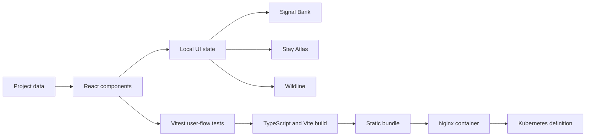

# Trending Pages

> Three interface studies, rebuilt as one engineering system.

서로 다른 세 개의 Vanilla HTML/CSS/JavaScript 프로젝트를 React와 TypeScript 기반의 하나의 포트폴리오 경험으로 재설계한 프로젝트입니다.

## 현재 상태

- 로컬 애플리케이션: 실행 가능
- 로컬 개발 주소: [http://127.0.0.1:4174](http://127.0.0.1:4174)
- 원격 GitHub 저장소: 없음 — 기존 `trending_pages` 저장소 삭제
- 공개 배포 주소: 없음
- CI/CD 파일: 새 저장소에서 재사용할 수 있는 템플릿으로만 포함

현재 README는 삭제된 저장소나 존재하지 않는 공개 URL을 전제로 하지 않습니다.

## 프로젝트 개요

초기 프로젝트들은 각각 스크롤 인터랙션, 반응형 그리드, 패럴랙스 효과를 학습하기 위해 제작했습니다. `Trending Pages`는 이 결과물을 단순히 한 폴더에 모으는 대신, 다음 기준으로 다시 설계했습니다.

- 반복되는 마크업을 typed data와 재사용 가능한 컴포넌트로 전환
- DOM 직접 조작을 React의 명시적인 상태 흐름으로 전환
- 모바일과 데스크톱에서 일관된 반응형 레이아웃 제공
- 키보드 조작과 모션 민감 사용자를 고려한 접근성 적용
- 사용자 흐름 테스트와 프로덕션 빌드 검증 추가
- 컨테이너와 Kubernetes까지 이어지는 운영 경계 정의

프로젝트의 핵심 메시지는 다음과 같습니다.

```text
BUILD → VERIFY → SHIP
```

화면을 구현하는 데서 끝나지 않고, 테스트하고 패키징하며 운영 가능한 형태로 전달하는 과정을 하나의 저장소에 담았습니다.

## 통합한 원본 프로젝트

| 원본 | 재구성한 경험 | 핵심 개선 |
| --- | --- | --- |
| [kakao-page](https://github.com/taeyoungk-dev/kakao-page) | Signal Bank | 스크롤 중심 연출을 상태 기반 금융 시뮬레이터로 확장 |
| [airbnb-clone-page](https://github.com/taeyoungk-dev/airbnb-clone-page) | Stay Atlas | 반복 숙소 카드를 typed data, 필터, 즐겨찾기 컴포넌트로 전환 |
| [Firewatch-clone-page](https://github.com/taeyoungk-dev/Firewatch-clone-page) | Wildline | 명령형 transform을 제한된 pointer parallax와 motion-safe CSS로 재설계 |

원본 프로젝트의 학습 목표는 유지하되, 통합 프로젝트의 디자인 시스템과 코드 구조는 새로 작성했습니다.

## 주요 경험

### 1. Signal Bank

금융 데이터를 시각적으로 탐색하는 인터랙티브 모듈입니다.

- 월 저축액 range input 제공
- 입력값에 따른 12개월 예상 자산 즉시 계산
- 잔액, 증감률, 목표 달성률을 하나의 정보 계층으로 표현
- label과 input을 연결해 키보드 및 보조기기 접근성 확보
- 입력 상태와 표시 상태를 React의 단방향 데이터 흐름으로 관리

```text
기존: scroll event + DOM style 변경
현재: React state + 계산된 UI
```

### 2. Stay Atlas

숙소 데이터를 탐색하고 저장하는 반응형 discovery grid입니다.

- `ALL`, `COAST`, `FOREST` 카테고리 필터
- 결과 개수의 즉시 갱신
- 숙소별 즐겨찾기 추가 및 해제
- 배열 데이터와 카드 UI를 분리한 재사용 가능한 구조
- 데스크톱 3열, 모바일 1열 반응형 레이아웃

```text
기존: 동일한 숙소 마크업 반복
현재: typed data → filter → reusable card
```

### 3. Wildline

Firewatch 스타일의 깊이감을 CSS 레이어와 포인터 입력으로 재해석한 경험입니다.

- 포인터의 중심 대비 거리를 레이어별 이동값으로 변환
- 이동량을 제한해 과도한 모션 방지
- pointer leave 시 중립 상태로 복귀
- CSS `clip-path`와 색상 면으로 외부 이미지 없는 풍경 구성
- `prefers-reduced-motion` 환경에서 애니메이션과 전환 최소화

```text
기존: scroll마다 무제한 transform 갱신
현재: bounded pointer input + reduced-motion fallback
```

## 구현 기술

### Frontend

- React `19.3`
- TypeScript `7.0`
- Vite `8.3`
- React local state
- Semantic HTML
- CSS Grid, Flexbox, custom properties, `clip-path`
- Desktop/mobile responsive layout

### Test and quality

- Vitest `5`
- Testing Library
- Strict TypeScript configuration
- Production build validation
- Git diff whitespace validation

### Delivery and runtime definitions

- GitHub Actions workflow templates
- Multi-stage Docker build
- Unprivileged Nginx runtime
- SPA fallback routing
- Immutable static asset cache headers
- `/healthz` health endpoint
- Kubernetes Deployment and Service
- Readiness/liveness probes
- Resource requests and limits
- Non-root security context and Linux capability drop

## 구현하지 않은 기술

다음 항목은 장기 목표 기술이지만 현재 코드에 구현된 것처럼 주장하지 않습니다.

- Java / Spring Boot API
- PostgreSQL / JPA
- Redis
- Kafka
- 사용자 인증 및 권한 관리
- 실제 클라우드 Kubernetes 배포
- 운영 환경의 metrics, logs, distributed traces

해당 기술은 실제 데이터 저장이나 분석 요구사항이 추가될 때 단계적으로 도입할 예정입니다.

## 애플리케이션 구조



`src/data.ts`가 케이스 스터디의 공통 데이터 구조를 제공하고, `src/App.tsx`가 섹션과 인터랙션 상태를 구성합니다. 시각 시스템과 반응형 규칙은 `src/styles.css`에 집중되어 있습니다.

## 접근성

- 본문으로 바로 이동하는 skip link
- 의미에 맞는 `button`, `a`, `section`, `article` 사용
- 아이콘과 시각 요소에 적절한 accessible name 또는 `aria-hidden` 적용
- `role="dialog"`, `aria-modal`, 제목 연결을 적용한 모달
- 모달이 열릴 때 닫기 버튼으로 포커스 이동
- `Escape` 키로 모달 종료
- 모달이 열린 동안 배경 스크롤 잠금
- `prefers-reduced-motion` 사용자의 애니메이션 최소화

## 자동 테스트

`src/App.test.tsx`에서 다음 핵심 흐름을 검증합니다.

1. Signal Bank, Stay Atlas, Wildline이 모두 렌더링되는지 확인
2. Signal Bank 인터랙션을 열고 `Escape`로 닫을 수 있는지 확인
3. Stay Atlas에서 `FOREST` 필터가 결과에 반영되는지 확인
4. 이력서 기준 이메일, 전화, LinkedIn, 기술 블로그 링크가 유지되는지 확인

전체 검증은 다음 명령으로 실행합니다.

```bash
npm run check
```

실행 순서:

```text
Vitest → TypeScript compile check → Vite production build
```

## 로컬에서 실행하기

### 준비 사항

- Node.js `22.12` 이상
- npm `10` 이상

현재 로컬 프로젝트 경로:

```text
/Volumes/D드라이브/Project/trending_pages
```

### 처음 한 번만 의존성 설치

```bash
cd "/Volumes/D드라이브/Project/trending_pages"
npm ci
```

`package-lock.json`에 고정된 버전을 사용하기 위해 `npm install`보다 `npm ci`를 권장합니다.

### 개발 서버 실행

```bash
cd "/Volumes/D드라이브/Project/trending_pages"
npm run dev
```

브라우저에서 다음 주소를 엽니다.

```text
http://127.0.0.1:4174
```

`npm run dev`에는 `--port 4174 --strictPort`가 포함되어 있습니다. 따라서 항상 `4174`를 사용하며, 이 포트가 이미 사용 중이면 임의의 다른 포트로 변경하지 않고 오류를 표시합니다.

개발 서버를 종료하려면 실행 중인 터미널에서 `Control + C`를 누릅니다.

### 프로덕션 빌드 확인

개발 서버를 먼저 종료한 후 실행합니다.

```bash
npm run build
npm run preview
```

프로덕션 미리보기도 다음 주소를 사용합니다.

```text
http://127.0.0.1:4174
```

### Docker로 실행

Docker Desktop 또는 Docker Engine을 실행한 후:

```bash
docker build -t trending-pages .
docker run --rm -p 8080:8080 trending-pages
```

브라우저 주소:

```text
http://127.0.0.1:8080
```

상태 확인:

```bash
curl http://127.0.0.1:8080/healthz
```

`ok`가 반환되면 Nginx 컨테이너가 요청을 받을 준비가 된 상태입니다.

## npm 명령어

| 명령어 | 역할 |
| --- | --- |
| `npm run dev` | `4174` 포트에서 개발 서버 실행 |
| `npm run test` | 테스트 전체를 한 번 실행 |
| `npm run test:watch` | 변경을 감지하며 테스트 반복 실행 |
| `npm run build` | TypeScript 검사 후 프로덕션 bundle 생성 |
| `npm run preview` | `4174` 포트에서 프로덕션 bundle 미리보기 |
| `npm run check` | 테스트와 프로덕션 빌드를 순서대로 실행 |

## 디렉터리 구조

```text
.
├── .github/workflows/
│   ├── ci.yml                 # 새 저장소에서 사용할 자동 검증 템플릿
│   └── deploy-pages.yml       # 새 저장소에서 사용할 수동 Pages 배포 템플릿
├── infra/
│   ├── k8s/deployment.yaml    # Deployment, Service, probes, resources
│   └── nginx.conf             # SPA routing, cache, headers, health check
├── src/
│   ├── App.tsx                # 페이지 섹션과 세 인터랙션
│   ├── App.test.tsx           # 핵심 사용자 흐름 테스트
│   ├── data.ts                # 타입이 적용된 프로젝트 데이터
│   ├── main.tsx               # React 진입점
│   ├── styles.css             # 디자인 시스템과 반응형 스타일
│   └── test/setup.ts          # 테스트 환경 설정
├── CONTRIBUTING.md            # 개발 및 커밋 규칙
├── Dockerfile                 # build/runtime 멀티 스테이지 이미지
├── package.json
└── vite.config.ts
```

## 새 GitHub 저장소를 연결할 때

현재는 연결된 원격 저장소가 삭제된 상태입니다. 새로운 저장소를 만든 후에만 다음 과정을 수행합니다.

```bash
git remote set-url origin https://github.com/USER/NEW_REPOSITORY.git
git push -u origin main
```

배포 workflow는 실행 시 새 저장소 이름으로 Vite base path를 자동 구성합니다. GitHub Pages를 사용할 경우 새 저장소의 Pages 설정과 공개 범위를 별도로 확인해야 합니다.

## 기술 선택과 트레이드오프

| 선택 | 이유 | 현재 한계 |
| --- | --- | --- |
| React local state | 별도 서버 없이 인터랙션을 즉시 시연 | 새로고침 후 즐겨찾기 상태가 유지되지 않음 |
| Typed project data | 세 케이스 스터디를 일관된 구조로 관리 | CMS 또는 API와 연동되지 않음 |
| CSS-generated visual | 외부 이미지 장애와 라이선스 의존성 최소화 | 실제 상품 사진보다 추상적인 표현 |
| Static-first architecture | 로컬 실행과 정적 배포가 단순함 | 인증, 영속 데이터, 서버 분석 기능 없음 |
| Manual production workflow | 자동 검증과 외부 공개 행위를 분리 | 배포 시 명시적인 수동 실행 필요 |

## 커리어 목표와의 연결

이 프로젝트는 Java Backend에서 Cloud, AI, Data, Cybersecurity로 확장하는 장기 목표 중 다음 기반 역량을 보여줍니다.

- 상태와 데이터 흐름을 구조화하는 소프트웨어 설계
- 사용자 경험을 자동 테스트로 보호하는 품질 관점
- 애플리케이션을 container와 cluster 경계까지 연결하는 시스템 사고
- health check, resource limit, non-root runtime을 고려하는 운영 관점
- 구현한 기술과 계획 중인 기술을 구분하는 기술 커뮤니케이션

## 포트폴리오 소개 문구

### 한국어

> 세 개의 Vanilla JavaScript 인터페이스 프로젝트를 React와 TypeScript 기반의 하나의 포트폴리오로 재설계했습니다. 금융 계산, 숙소 탐색, 패럴랙스 인터랙션을 상태 기반 컴포넌트로 구현하고, Vitest 자동 검증부터 Docker, Nginx, Kubernetes 운영 경계까지 연결했습니다.

### English

> Re-engineered three standalone Vanilla JavaScript interface studies into a unified React and TypeScript portfolio. Built state-driven fintech, travel discovery, and parallax interactions, protected critical user flows with automated tests, and defined delivery boundaries through Docker, an unprivileged Nginx runtime, and Kubernetes manifests.

### Resume bullets

- Re-engineered three independent HTML, CSS, and JavaScript studies into one React 19 and TypeScript 7 application with reusable typed project data.
- Implemented state-driven financial projection, category filtering, favorites, and bounded pointer-parallax interactions with responsive and reduced-motion behavior.
- Added automated user-flow tests and defined container and Kubernetes delivery with health probes, resource limits, and a non-root runtime.

## 다음 단계

### Backend foundation

- [ ] Java 21 + Spring Boot REST API로 프로젝트 데이터 제공
- [ ] PostgreSQL + JPA로 즐겨찾기와 interaction event 영속화
- [ ] Spring Security 기반의 최소 권한 API 경계
- [ ] API contract test와 frontend loading/error state

### Cloud and data evolution

- [ ] Redis를 활용한 project catalog cache
- [ ] Kafka 기반 interaction analytics event stream
- [ ] OpenTelemetry metrics와 traces
- [ ] Cloud-managed Kubernetes와 Infrastructure as Code
- [ ] 한국어/영어 콘텐츠 전환과 글로벌 접근성 검수

## 작성자

**김태영**

Backend · Cloud · Data Engineer in progress

- GitHub: [@taeyoungk-dev](https://github.com/taeyoungk-dev)
- LinkedIn: [linkedin.com/in/taeyoung-kim-9b743140b](https://www.linkedin.com/in/taeyoung-kim-9b743140b/)
- Tech Blog: [taeyoungkim.dev/ko](https://www.taeyoungkim.dev/ko)
- Email: [taeyoungkdev@gmail.com](mailto:taeyoungkdev@gmail.com)
